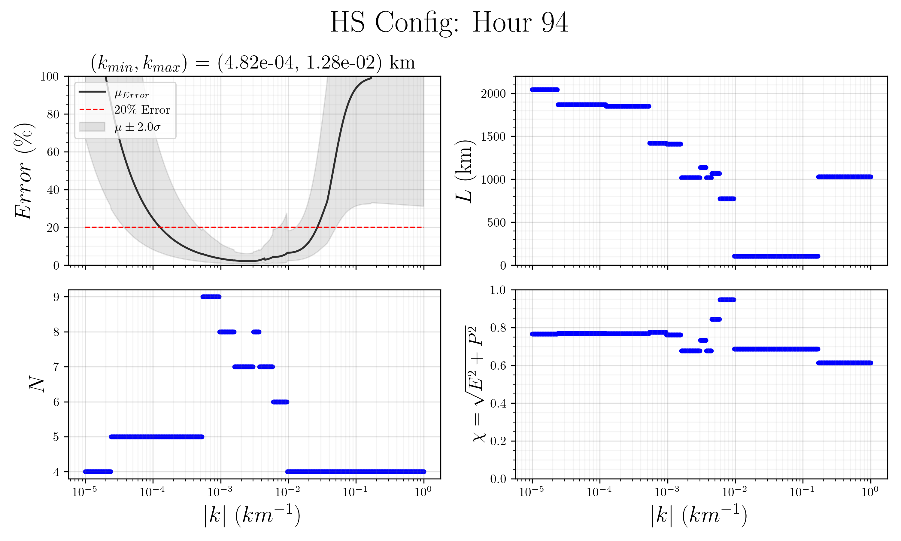

# NEWTSS
An algorithm to estimate the error in the wave telescope method as a function of wavevector magnitude.


## Methods
We generated hundreds of random spacecraft configurations who each contain between 4 and 9 spacecraft. We then used each of these configurations to create synthetic timeseries measurements of magnetic fields, as if they were taken from a plane wave. These plane waves varied in direction of travel, velocity, frequency, and phase. Using the magnetic field timeseries, we applied the wave telescope method to estimate the wavevector of the observed plane wave. We observed that these estimations had errors that varied with 
- Number of spacecraft in the configuration: $N$
- Shape of spacecraft configuration: $\chi = \sqrt{E^2 + P^2}$ (where $E$ and $P$ are elongation and planarity)
- Relative magnetude of the wavevector: $\bar{k} = kL$ (where $L$ is the size of the spacecraft configuration)

### Learned Equations:
We studied the data to find equations that described the distribution of these errors. Overall, the error in the wave telescope method varied like

$\log_{10}Error(\bar{k},\chi) \sim N(\mu, \sigma).$

However, there were a population of events that did not follow this distribution. These events occured when the wave signal was *aliased*. We captured the probability of this occuring in the equation $P(alias|\bar{k},\chi)$. We captured the mean and standard deviation of the error in the method in all other cases in the equations $\mu(\bar{k},\chi)$ and $\sigma(\bar{k},\chi)$. These equations have the form
- $\mu(\bar{k},\chi) = \log_{10}(a_0^{\chi - a_1} + a_2) + (a_3^{\chi - a_4} + a_5)\log_{10}\bar{k}$
- $\sigma(\bar{k},\chi) = c_0 + c_1\log_{10}\bar{k} + c_2 \chi^2$
- $P(alias|\bar{k},\chi) = 0.5( 1 + \tanh[4\log_{10}\bar{k} + b_0\chi^2 + b_1\chi + b_2] )$

We have used Bayesian Inference to determine the value of the coefficients $a_0(N), a_1(N), ..., c_2(N)$ and supplied them in the 'saved_coef' folder. 

### Application:
Using these simple equations, we can estimate the value of error that will occur for any configuration of 4-9 spacecraft. Given this a priori estimate of error, we can identidy the **best** subset of spacecraft to use to detect a given wavevector. 


## How to Use
Unaltered, the code will read in the supplied spacecraft positional files from an example (pre Phase-B) 9-spacecraft HelioSwarm configuration. It will then select the optimal subset of spacecraft for a range of wavevectors for one of the configurations (the default is the configuration at hour 94 of the mission). The optimal is selected by minimizing the quantity $\mu_{error} + \alpha \sigma_{error}$ (where $\alpha=2$ by default). To alter which hour configuration is optimized or what this $\alpha$ value is, change these lines of code:
```
hour = 94                       # Configuration hour of HS Phase B DRM mission
std_coef = 2                    # see above
```
The code also reports which magnetudes of wavevectors are possible to reconstruct with errors ($\mu_{error} + \alpha \sigma_{error}$) less than a certain tolerance. To change the value of this tolerance, edit this line of code:
```
Er_thres = 20                   # see above
```

Finally, the code produces a series of figures to visuallize its selection of subset at each scale. The concluding figure, found in the 'Optimal_Ngon' folder, will picture the distribution of error at each scale after selection of the best subset. It also show how many spacecraft ($N$) are in this optimal subset, what the size ($L$) of this subset is, and what it's shape parameter ($\chi$) is.




## References
This work was originally published in the 2023 ApJS paper *Data-driven Uncertainty Quantification of the Wave Telescope Technique: General Equations and Demonstration Using HelioSwarm* by Broeren and Klein
[open access link](https://doi.org/10.3847/1538-4365/acc6c7)
